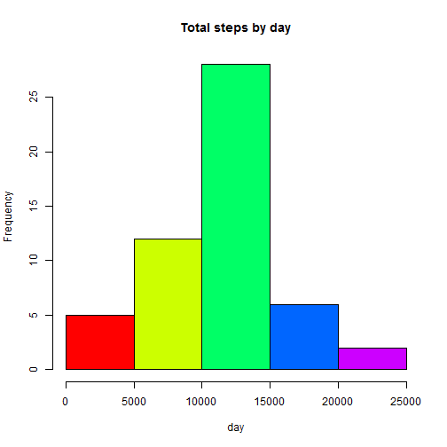
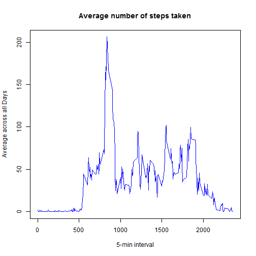
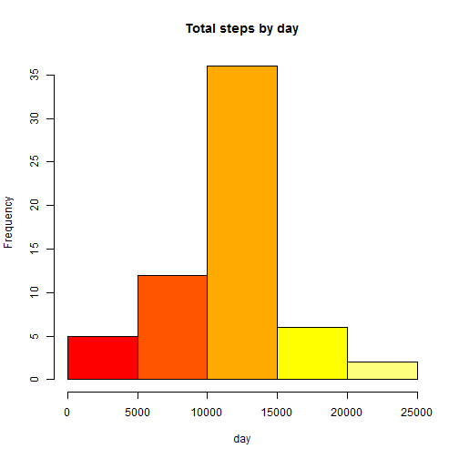
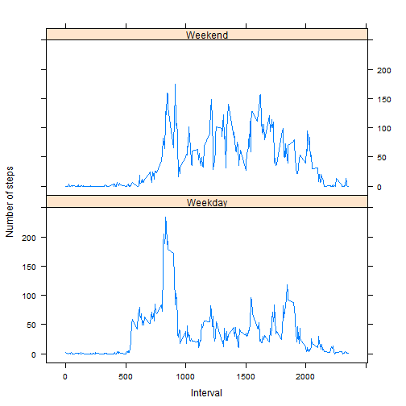

## Loading and preprocessing the data


```r
activity <- read.csv("activity.csv", colClasses = c("numeric", "character", "numeric"))
head(activity)
```

```
##   steps       date interval
## 1    NA 2012-10-01        0
## 2    NA 2012-10-01        5
## 3    NA 2012-10-01       10
## 4    NA 2012-10-01       15
## 5    NA 2012-10-01       20
## 6    NA 2012-10-01       25
```

```r
library(lattice)
activity$date <- as.Date(activity$date, "%Y-%m-%d")
```

## What is mean total number of steps taken per day?


```r
StepsTotal <- aggregate(steps ~ date, data = activity, sum, na.rm = TRUE)
hist(StepsTotal$steps, main = "Total steps by day", xlab = "day", col = rainbow(5))
```

 

```r
mean(StepsTotal$steps) # Calculate mean
```

```
## [1] 10766.19
```

```r
median(StepsTotal$steps) # Calculate median
```

```
## [1] 10765
```

## What is the average daily activity pattern?


```r
time_series <- tapply(activity$steps, activity$interval, mean, na.rm = TRUE)
plot(row.names(time_series), time_series, type = "l", xlab = "5-min interval", 
    ylab = "Average across all Days", main = "Average number of steps taken", 
    col = "blue") # time series Plot
```

 

##### Which 5-minute interval, on average across all the days in the dataset, contains the maximum number of steps?


```r
max_interval <- which.max(time_series)
names(max_interval)
```

```
## [1] "835"
```

## Imputing missing values

##### Calculate and report the total number of missing values in the dataset (i.e. the total number of rows with NAs)

```r
activity_NA <- sum(is.na(activity))
activity_NA
```

```
## [1] 2304
```

##### Devise a strategy for filling in all of the missing values in the dataset.

##### Replaced Na by mean in 5 min interval


```r
StepsAverage <- aggregate(steps ~ interval, data = activity, FUN = mean)
fillNA <- numeric()
for (i in 1:nrow(activity)) {
    obs <- activity[i, ]
    if (is.na(obs$steps)) {
        steps <- subset(StepsAverage, interval == obs$interval)$steps
    } else {
        steps <- obs$steps
    }
    fillNA <- c(fillNA, steps)
}
```
##### Create a new dataset that is equal to the original dataset but with the missing data filled in


```r
new_activity <- activity
new_activity$steps <- fillNA
```

##### Make a histogram of the total number of steps taken each day and Calculate and report the mean and median total number of steps taken per day


```r
StepsTotal2 <- aggregate(steps ~ date, data = new_activity, sum, na.rm = TRUE)
hist(StepsTotal2$steps, main = "Total steps by day", xlab = "day", col = heat.colors(5))
```

 

```r
mean(StepsTotal2$steps) # Mean
```

```
## [1] 10766.19
```

```r
median(StepsTotal2$steps) # Median
```

```
## [1] 10766.19
```
##### After replacing the missing value with "mean", new mean remain the same but the median is a little bit different.


## Are there differences in activity patterns between weekdays and weekends?

##### Create a new factor variable in the dataset with two levels -- "weekday" and "weekend" indicating whether a given date is a weekday or weekend day.


```r
day <- weekdays(activity$date)
daylevel <- vector()
for (i in 1:nrow(activity)) {
    if (day[i] == "Saturday") {
        daylevel[i] <- "Weekend"
    } else if (day[i] == "Sunday") {
        daylevel[i] <- "Weekend"
    } else {
        daylevel[i] <- "Weekday"
    }
}
activity$daylevel <- daylevel
activity$daylevel <- factor(activity$daylevel)

stepsByDay <- aggregate(steps ~ interval + daylevel, data = activity, mean)
names(stepsByDay) <- c("interval", "daylevel", "steps")
```

##### Make a panel plot containing a time series plot (i.e. type = "l") of the 5-minute interval (x-axis) and the average number of steps taken, averaged across all weekday days or weekend days (y-axis)


```r
xyplot(steps ~ interval | daylevel, stepsByDay, type = "l", layout = c(1, 2), 
    xlab = "Interval", ylab = "Number of steps")
```

 

